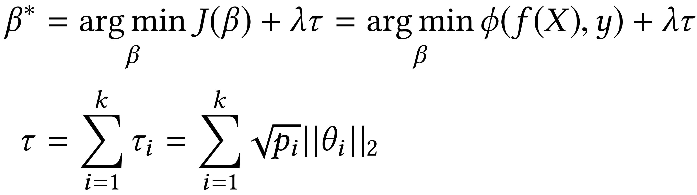
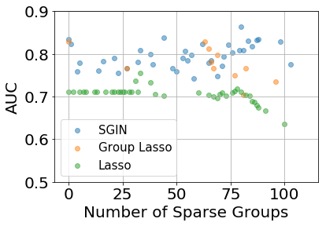
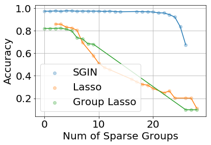
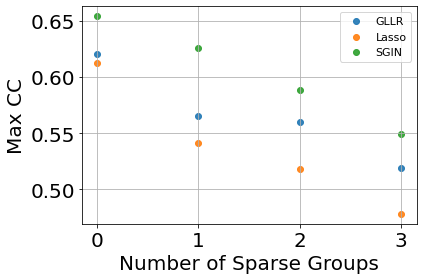

# Sparsely Groupped Input Variables in Neural Network (SGIN)

This repository contains the code and model used for the following papers:

- [[PDF Coming Soon]]() Beibin Li, Erin Barney, Caitlin Hudac, Nicholas Nuechterlein, Pamela Ventola, Linda Shapiro, and Frederick Shic. 2020. _Selection of Eye-Tracking Stimuli for Prediction by Sparsely Grouped Input Variablesfor Neural Networks: towards Biomarker Refinement for Autism_. In ETRA '20: ACM Symposium on Eye Tracking Research and Appli-cations, June 02–05, 2020, Stuttgart, Germany. ACM, New York, NY, USA, 10 pages
- [[PDF]](https://arxiv.org/pdf/1911.13068) Beibin Li, Nicholas Nuechterlein, Erin Barney, Caitlin Hudac, Pamela Ventola, Shaprio Linda, Frederick Shic. 2019. _Sparsely Grouped Input Variables for Neural Networks_. arXiv preprint arXiv:1911.13068.

The contribution of this project is:
1. The SGIN model, which contains groups of grouped L1 loss and Stochastic Blockwise Coordinated Gradient Descent (SBCGD) algorithm.
2. Application to analyze the real-world eye-tracking dataset for children with Autism Spectrum Disorder (ASD). We also provided experiments for other simpler datasets, including RNA splicing, MNIST, and XOR simulation.  


## Install Required Packages
Using this repository might require some familiarity with Python coding. We recommend you to use [Anaconda](https://www.anaconda.com/distribution/) to manage Python and its packages. 

After installing Python or Anaconda, you should install the dependencies:
1. Install PyTorch following the official [guide](https://pytorch.org/)
2. Install other required packages `pip install pyglmnet sklearn pandas scipy tqdm matplotlib python-mnist PyWavelets`


If you are comfortable with command line tools, you can read [conda tutorial](https://docs.conda.io/projects/conda/en/latest/user-guide/tasks/manage-environments.html) and [environment.yml](environment.yml) file for more package details. 


## Use SGIN for Your Project
If you would like to use SGIN for your project, you can simply copy and paste one file (i.e. the [sgin_model.py](sgin_model.py) code) to your project folder. Then, you can use SGIN easily. 


## Model and Algorithm Explanation

We want to solve "grouped variable" selection problem, and the intuition of our solution is straightforward.

People usually use L1 regularization to achieve sparsity in a machine learning model, which is a common way since 1990s. In 2006, Yuan et al. developed group lasso (with grouped L1 regularization) to achieve sparsity for a group of variables. After 2010, people apply this method to prune convolutional neural networks, which can be achieved by enforcing a convolutional filter to be sparse. Detailed introduction and discussion about previous studies can be found in our papers.


Inspired previous studies, we define our loss below, which contains a group of grouped L1 regularization (yes, a group of groups): 

<br>
<p align="center"></img></p>
<br>

Previous studies usually use standard optimizers (e.g. SGD, Adam, RMSProp, etc.) to train their models, but their solution does not fit our needs.
Applying gradient descent (GD) or SGD directly to the loss does not guarantee group sparsity for the NN, because SGD does not guarantee convergence if the loss is not differentiable. However, the regularization for each group $||\theta_i||_2$ is not differentiable at the origin, which is preferred by our loss function to sparse groups.
Using coordinate descent, blockwise coordinate descent (BCD), or graphical lasso algorithm is not feasible either because these methods can only optimize parameters in the first hidden layer. 
Instead, we combine these optimization methods to create the new optimization algorithm, Stochastic Blockwise Coordinated Gradient Descent, shown below.

<p align="center"></img></p>


### Code and Folder Organization
- [sgin_model.py](sgin_model.py): contains the SGIN model and its optimizers
- [sgin_utils.py](sgin_utils.py): contains some helper functions for experiments.

- [data_prepare](data_prepare/): Folder with the data and data prepare code
    - [get_mnist.sh](data_prepare/get_mnist.sh) can download the MNIST dataset to your computer
    - [preprocess_mnist.py](data_prepare/preprocess_mnist.py) is used to pre-process the MNIST dataset and save to pickle format
    - [preprocess_mnist_wavelet.py](data_prepare/preprocess_mnist_wavelet.py) pre-process the MNIST dataset in Wavelet presentation and save to pickle format
    - [preprocess_rna_splicing.py](data_prepare/preprocess_rna_splicing.py) pre-process the MIT RNA dataset (aka Hollywood RNA Alternative Splicing Database) and save to CSV files.
    


## Experiments

### Autism Classification and Regression
Here we use [et_asd_classification.py](et_asd_classification.py) for the ASD/non-ASD classification experiments and 
[et_regression.py](et_regression.py) for the regression experiments.

Note that we only provided the dummy data (i.e. randomly generated data) for the eye-tracking experiments because of IRB (Institutional Review Board) restrictions.
In the future, we will provide a public link for users to register account, sign consent form, and then download the actual eye-tracking data. 

The dummy data are stored in CSV files under the [data_prepare/](data_prepare/) folder. The last column of each CSV file is the label for the data, and all the other columns are features that will be used for machine learning.  Note that the model might fail to converge with these randomly generated "dummy" data.

#### ASD/non-ASD Classification

Details about our ASD/non-ASD classification can be found in our ACM ETRA 2020 paper. Here, we discuss how to run the experiments in Python.

Run the commands `python et_asd_classification.py --models SGIN lasso group_lasso` to get results for SGIN, lasso, and group lasso. The results will be saved in a TSV file.

<p align="center"></img></p>

You can run  `python et_asd_classification.py --models theory nn sgd` command if you want to compare different optimization algorithms for the SGIN model.


#### ADOS/IQ/SRS/Vineland Regression

ADOS, IQ, SRS, and Vineland scores are important to survey autism severity. Our SGIN model and lasso performs well to predict IQ for participants, but all methods failed to predict ADOS/SRS/Vineland scores because of the limitation of our dataset. In another on-going study, our collaborators collected similar eye-tracking data from 3x more participants and achieved satisfiable regression results with linear models. More studies are needed to fully investigate eye-tracking features and meaningful biomarkers for children with ASD in the future.

To run all the regression experiments, you can try the commands below:
```
python et_regression.py --models SGIN lasso --task ados
python et_regression.py --models SGIN lasso --task iq
python et_regression.py --models SGIN lasso --task srs
python et_regression.py --models SGIN lasso --task vineland
```

More regression results and discussions can be found in our paper:

Beibin Li, Erin Barney, Caitlin Hudac, Nicholas Nuechterlein, Pamela Ventola, Linda Shapiro, and Frederick Shic. 2020. _Selection of Eye-Tracking Stimuli for Prediction by Sparsely Grouped Input Variablesfor Neural Networks: towards Biomarker Refinement for Autism_. In ETRA '20: ACM Symposium on Eye Tracking Research and Appli-cations, June 02–05, 2020, Stuttgart, Germany. ACM, New York, NY, USA, 10 pages


### MNIST Classification Experiment


Results are shown below.

<p align="center"></img></p>


### RNA Splicing Experiment

In this experiment, we will perform binary classification on Hollywood RNA Alternative Splicing Database. The dataset can be downloaded from [Google Drive](https://drive.google.com/file/d/1bJhqThfLHym1BJSj1qdWe6iQrsZz-rev/view?usp=sharing), a mirror of the [original](http://hollywood.mit.edu/hollywood/Login.php) dataset. Please follow the instructions, guidelines, and license requirements from the MIT Hollywood group. Download and unzip the file, so that you have the folder in the form "data_prepare/mit_gene". Then, run
`python preprocess_rna_splicing.py` to convert the files. 

Before deep learning era, some researchers use balance sampling to get a subset of training set so that both the positive and negative class have equal number of samples. In recent decade, people prefer to use as much data as possible and then apply weighted loss to balance the loss from the positive and negative classes.
In this experiment, we will perform both the "balance subset with standard loss" and the "all training samples with weighted loss" experiments. We split the data into train/valid/test parts, run the machine learning models, and report the testing results from the model with the best validation performance. Data split details is in [preprocess_rna_splicing.py](data_prepare/preprocess_rna_splicing.py) code and the [paper](https://arxiv.org/pdf/1911.13068) (page. 5).


We select the run with best validation performance in each "Number of Sparse Groups" and then report the testing performance. The higher the Max CC, the better the results. Here we compare SGIN, lasso, and GLLR (group lasso for logistic regression). The GLLR results are computed from the [R package (grplasso)](https://cran.r-project.org/web/packages/grplasso/index.html) provided by Meier et al.

Run the following commands for experiments
```
python rna_experiment.py --models SGIN lasso --sampling balance
python rna_experiment.py --models SGIN  --sampling all
```

<p align="center"></img></p>


You can also try to use alternative optimization algorithms for this dataset. 
```
python rna_experiment.py --models sgd theory  --sampling balance
python rna_experiment.py --models sgd theory  --sampling all
```

Recommended Papers for this dataset:
- Yeo, Gene, and Christopher B. Burge. "Maximum entropy modeling of short sequence motifs with applications to RNA splicing signals." Journal of computational biology 11.2-3 (2004): 377-394.
- Meier, Lukas, Sara Van De Geer, and Peter Bühlmann. "The group lasso for logistic regression." Journal of the Royal Statistical Society: Series B (Statistical Methodology) 70.1 (2008): 53-71.
