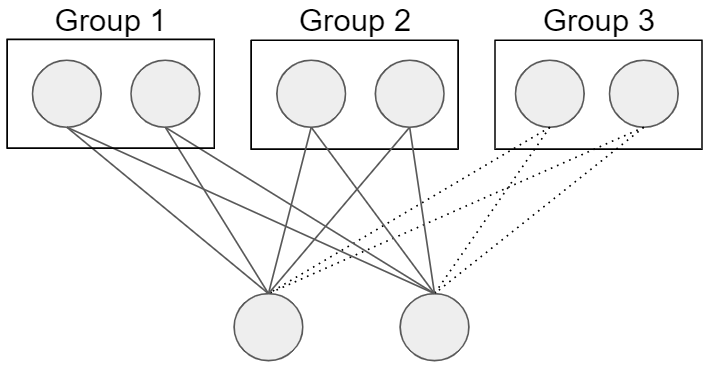
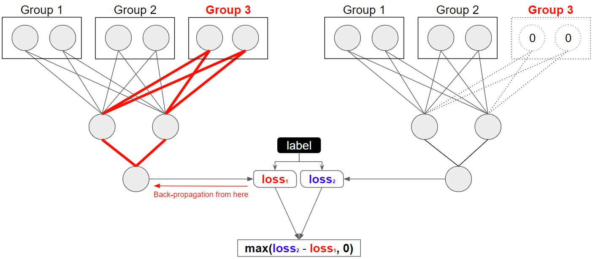

# Sparsely Groupped Input Variables in Neural Network (SGIN)

This repository contains the code and model used for the following papers:

- [PDF]() Beibin Li, Erin Barney, Caitlin Hudac, Nicholas Nuechterlein, PamelaVentola, Linda Shapiro, and Frederick Shic. 2020. Selection of Eye-Tracking Stimuli for Prediction by Sparsely Grouped Input Variablesfor Neural Networks: towards Biomarker Refinement for Autism.InETRA ’20: ACM Symposium on Eye Tracking Research and Appli-cations, June 02–05, 2020, Stuttgart, Germany.ACM, New York, NY,USA, 10 pages
- [PDF](https://arxiv.org/pdf/1911.13068) Beibin Li, Nicholas Nuechterlein, Erin Barney, Caitlin Hudac, Pamela Ventola, Shaprio Linda, Frederick Shic. 2019. Sparsely Grouped Input Variables for Neural Networks. arXiv preprint arXiv:1911.13068.

The contribution of this project is:
1. The SGIN model, which contains the Grouped L1 loss and Stochastic Blockwise Coordinated Gradient Descent (SBCGD) algorithm. Note that lots of previous research have applied similar loss to neural networks, but we are the first one focused on developing a faster optimization algorithm with given loss.
2. Application to real world dataset, including the eye-tracking dataset for children with Autism Spectrum Disorder (ASD).

## Install Required Packages
Using this repository might require some familiarity with Python coding. We recommend you to use [Anaconda](https://www.anaconda.com/distribution/) to manage Python and its packages. 

After installing Python or Anaconda, you should install the dependencies:
1. Install PyTorch following the official [guide](https://pytorch.org/)
2. Install other required packages `pip install pyglmnet sklearn pandas scipy tqdm matplotlib PyWavelets`

If you are comfortable with command line tools, you can read [conda tutorial](https://docs.conda.io/projects/conda/en/latest/user-guide/tasks/manage-environments.html) and [environment.yml](environment.yml) file for more package details. 

## Use SGIN for Your Project
If you would like to use SGIN for your project, you can simply copy and paste two files (i.e. [sgin_model.py](sgin_model.py) and [utils.py]) to your project folder. Then, you can use SGIN easily. 

## Model and Algorithm Explanation

The intuition of our model is loss function is straightforward. 

## Code and Folder Organization

### Model and Source code
- [sgin_model.py](sgin_model.py): contains the SGIN model and its optimizers
- [utils.py](utils.py): contains some helper functions for experiments.

- [data_prepare](data_prepare/): Folder with the data and data prepare code
    - [get_mnist.sh](data_prepare/get_mnist.sh) can download the MNIST dataset to your computer
    - [preprocess_mnist.py](data_prepare/preprocess_mnist.py) is used to pre-process the MNIST dataset and save to pickle format
    - [preprocess_mnist_wavelet.py](data_prepare/preprocess_mnist_wavelet.py) pre-process the MNIST dataset in Wavelet presentation and save to pickle format
    - [preprocess_rna_splicing.py](data_prepare/preprocess_rna_splicing.py) pre-process the MIT RNA dataset (aka Hollywood RNA Alternative Splicing Database) and save to CSV files.
    

## Experimentation Code

### Autism Classification and Regression
Here we use [et_asd_classification.py](et_asd_classification.py) for the ASD/non-ASD classification experiment and 
[et_regression.py](et_regression.py) for the IQ regression experiment.

### MNIST Classification Experiment

### MNIST Wavelet Experiment

### RNA Splicing Experiment

In this experiment, we still perform binary classification on a simple dataset, Hollywood RNA Alternative Splicing Database. 

Before deep learning era, some researchers use balance sampling to sample training data so that both the positive and negative class have equal number of training samples. In recent decade, people prefer to use as much data as possible and then apply weighted loss to balance the loss from the positive and negative classes.
In this experiment, we will perform both the "balance sampling with standard loss" and the "random sampling with weighted loss" experiments. We split the data into train/valid/test parts, run the machine learning models, and report the testing results from the model with the best validation performance. Data split details is in [preprocess_rna_splicing.py](data_prepare/preprocess_rna_splicing.py) code and the [paper](https://arxiv.org/pdf/1911.13068) (page. 5).

We select the run with best validation performance in each "Number of Sparse Groups" and then report the testing performance. The higher the Max CC, the better the results.

Recommended Papers:
- Yeo, Gene, and Christopher B. Burge. "Maximum entropy modeling of short sequence motifs with applications to RNA splicing signals." Journal of computational biology 11.2-3 (2004): 377-394.
- Meier, Lukas, Sara Van De Geer, and Peter Bühlmann. "The group lasso for logistic regression." Journal of the Royal Statistical Society: Series B (Statistical Methodology) 70.1 (2008): 53-71.
